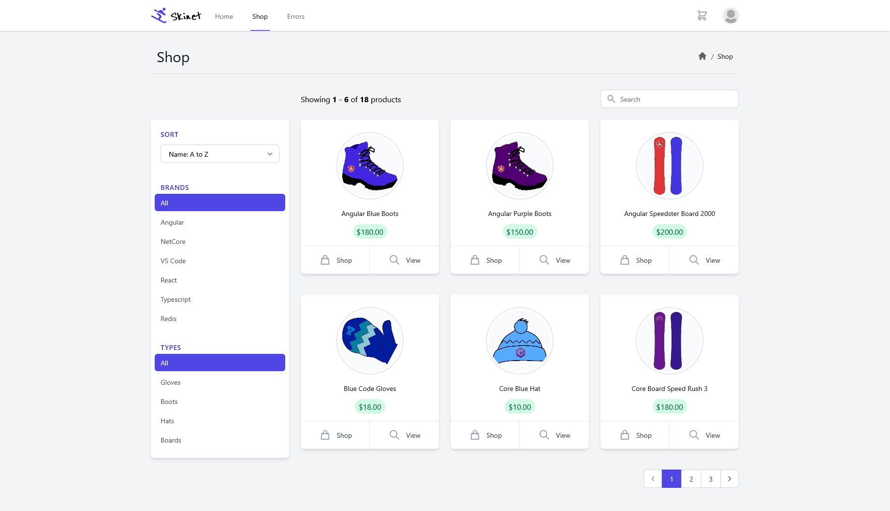

# Skinet - An Simple E-Commerce App (Udemy Course Project)

**Demo**: [Xucong's Skinet Demo](https://xzhan-skinet-demo.shop)

- Test Account: `bob@test.com`
- Password: `Pa$$w0rd`

## Showcase



More screenshots can be found in the `showcase` folder.

## Features

- Built with ASP.NET 5 and Angular 12
- Product display
- Shopping cart
- Checkout with Strip
- Order summary

## Run the demo project locally

### Prerequisites:

- [Docker](https://www.docker.com/) & docker-compose
- [.NET 5 SDK](https://dotnet.microsoft.com/download)
- [Node.js 14](https://nodejs.org/en/)

### Start backend server

- Generate self-signed certificate for the backend project:

  - This can vary from system to system.
  - On Windows:
    ```
    dotnet dev-certs https -ep $env:USERPROFILE\.aspnet\https\aspnetapp.pfx -p crypticpassword
    dotnet dev-certs https --trust
    ```
  - More info can be found [here](https://docs.microsoft.com/en-us/dotnet/core/additional-tools/self-signed-certificates-guide#create-a-self-signed-certificate) in .NET docs.

- `docker-compose up -d`
- `dotnet watch --project API run`

### Start frontend project

- `cd client`
- `npm i`
- `npm start`

You should be able to visit [`https://localhost:4200/`](https://localhost:4200)

## Further enhancement ideas:

- [ ] Add tests
- [ ] An inventory system with an admin panel
- [ ] Product review system
- [ ] Be able to favorite product
- [ ] Rebuild the client with Vue/Svelte and compare different solutions
